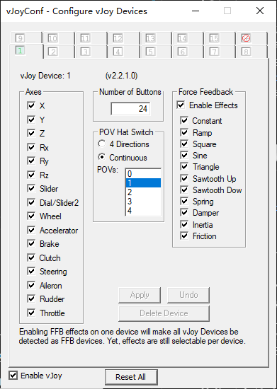
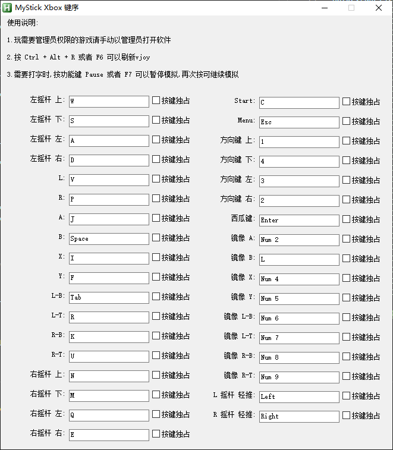

# 描述
莱莎1steam版，官方接入了模拟手柄并且可以使用鼠标，但是没有手柄的话，进游戏会一卡一卡的，有了vjoy，游戏视为接入了手柄就不再卡顿了。到了莱莎2官方实现了自动识别操作方式，手柄优先级最高，有了vjoy就会自动变成手柄操作模式，键鼠完全失效。也就是说，有了vjoy，流畅玩莱莎1，却不能玩莱莎2，在不影响vjoy的情况下，畅玩两代只能把vjoy用起来了。

利用AHK([AutoHotkey](https://www.autohotkey.com))实现的键盘操作vjoy输出手柄按键的脚本程序，能够实现全局的手柄按键输出并且不影响键盘的操作，目前仅支持全键盘方式，不支持鼠标，使用鼠标的话可参考相关项目的其他仓库，不过非AHK的需要安装[Interception](https://github.com/oblitum/Interception)，需要自行斟酌（不过我是不想装，不然为啥有这个项目）

# FAQ
+ Q: 为什么选AHK([AutoHotkey](https://www.autohotkey.com))
- A: vj有自带的sdk（c/c++，c#）但是按键捕获可能需要额外的辅助软件，并且，用sdk写了明明可以直接写一套（scpvbus），但是已经有完整的项目了。
+ Q:为什么开发
+ A:全局有效，不影响键盘使用，占用低，文件小，可随时二次开发并且二次开发简单，总之特点就是我的需求
+ Q:按键效率方面
+ A:不建议玩对灵敏度要求高的游戏
+ Q:游戏兼容性相关
+ A:正在全力适配莱莎2，并考虑适配其他游戏或者通用的配置

# 特点
- 不需要安装AHK即可运行
- 不需要安装额外软件即可运行
- 可以自定义按键
- 会AHK([AutoHotkey](https://www.autohotkey.com))的可以再编程
- 有占用键盘和不占键盘两种形式，都可对单独的按键设置
- 文件体积小占用低
- 安全无毒
- 可扩展性强，可编辑脚本实现按键连发，按键“宏”等
  

# 要求
- win10 64位（必须是64位系统，7，8.1，11未测试）
- 需要安装[vjoy](https://github.com/njz3/vJoy)
  
# 使用
1. 去[Releases]()下载编译后的包体
2. 解压到任意目录（最好不要有中文）
3. 打开vjoy的“configure vjoy”，设置为24键，1pov，勾选enable feedback
   
4. 打开mystick.exe，就可在托盘上看到 大H 图标
5. 单击图标进入按键设置，设置自己操作顺手的按键
   
6. 软件可以正常使用了，可以用vjoy的“monitor vjoy”查看按键情况
7. 打开游戏开玩

# 相关项目
+ vjoy 驱动[njz3/vjoy](https://github.com/njz3/vJoy)
+ 另一个作者的B0XX游戏控制AHK脚本[FuranHoshi/B0XX-vJoy](https://github.com/FuranHoshi/B0XX-vJoy)，实现了20xx的vjoy版，并且带按键宏
+ 大佬的AHK-vjoy接口[evilC/AHK-CvJoyInterface](https://github.com/evilC/AHK-CvJoyInterface)
+ 大佬的AHK的UCR程序[evilC/UCR](https://github.com/evilC/UCR)，可惜已停止维护
+ 上个项目的C#版[Snoothy/UCR](https://github.com/Snoothy/UCR)
+ vXbox 驱动[shauleiz/vGen](https://github.com/shauleiz/vGen)
+ vBox成品[djlastnight/KeyboardSplitterXbox](https://github.com/djlastnight/KeyboardSplitterXbox)
+ 用于非AHK的使用键盘的Interception[oblitum/Interception](https://github.com/oblitum/Interception)